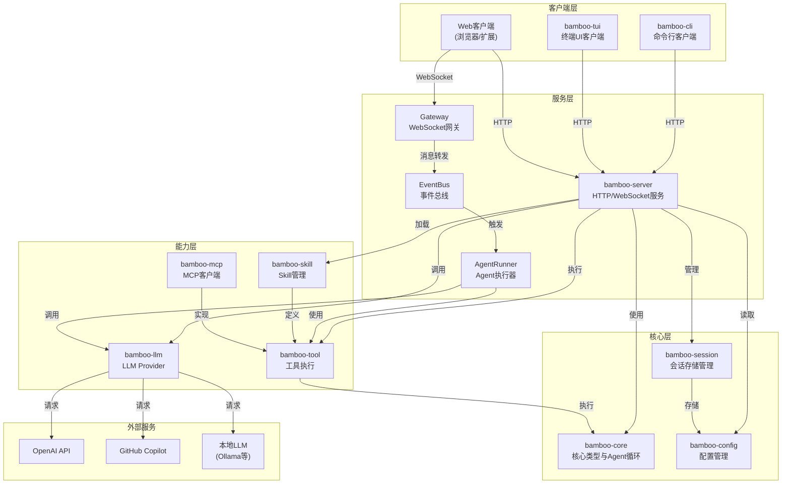

# Bamboo 系统架构图

## 1. 系统整体架构



## 2. 组件关系说明

### 2.1 Crate 依赖关系

| Crate | 职责 | 依赖 |
|-------|------|------|
| bamboo-core | 核心类型定义、Agent循环、工具接口 | - |
| bamboo-config | 配置加载、验证、热重载 | - |
| bamboo-llm | LLM Provider抽象、多提供商支持 | bamboo-core |
| bamboo-session | 会话存储、消息历史、索引 | bamboo-core |
| bamboo-tool | 工具定义、执行引擎 | bamboo-core |
| bamboo-skill | Skill发现、加载、热重载 | bamboo-tool |
| bamboo-mcp | MCP协议客户端、文件/命令工具 | bamboo-core, bamboo-tool |
| bamboo-server | HTTP服务、WebSocket网关、业务逻辑 | bamboo-core, bamboo-config, bamboo-llm, bamboo-skill, bamboo-tool |
| bamboo-cli | 命令行客户端 | bamboo-config |
| bamboo-tui | 终端UI客户端 | bamboo-config |

### 2.2 数据流

```
用户输入 -> Client -> HTTP/WebSocket -> Server -> EventBus -> AgentRunner
                                                            |
                                                            v
Session <- Storage <- 响应 <- LLM Provider <- 工具调用 <- Core
```

## 3. 关键技术选型

| 组件 | 技术 | 说明 |
|------|------|------|
| HTTP框架 | actix-web | 高性能异步HTTP服务 |
| WebSocket | tokio-tungstenite | 异步WebSocket实现 |
| 序列化 | serde + serde_json | Rust标准序列化方案 |
| 异步运行时 | tokio | Rust异步生态标准 |
| 配置管理 | bamboo-config | 自定义实现，支持热重载 |
| 存储 | JSONL | 追加写入，便于审计 |
| LLM协议 | OpenAI兼容API | 支持多种Provider |
| 工具协议 | MCP | Model Context Protocol |

## 4. 部署架构

### 4.1 开发环境

```
┌─────────────────────────────────────┐
│           开发机器                   │
│  ┌─────────┐    ┌───────────────┐  │
│  │ bamboo  │    │  LLM服务      │  │
│  │ -server │───▶│ (本地/远程)   │  │
│  │ -cli    │    │               │  │
│  │ -tui    │    │  ~/.bamboo/   │  │
│  └─────────┘    │  - config.json│  │
│                 │  - sessions/  │  │
│                 │  - skills/    │  │
│                 └───────────────┘  │
└─────────────────────────────────────┘
```

### 4.2 生产环境

```
┌─────────────┐     ┌─────────────────────────────────────┐
│   客户端     │     │           服务器                    │
│  ┌───────┐  │     │  ┌─────────┐    ┌───────────────┐  │
│  │ CLI   │──┼────▶│  │ bamboo  │    │  LLM服务      │  │
│  └───────┘  │     │  │ -server │───▶│ (OpenAI等)    │  │
│  ┌───────┐  │     │  │         │    │               │  │
│  │ TUI   │──┼────▶│  │ Gateway │    │  持久化存储    │  │
│  └───────┘  │     │  │         │    │  - SQLite/    │  │
│  ┌───────┐  │     │  │         │    │    PostgreSQL │  │
│  │ Web   │──┼────▶│  └─────────┘    └───────────────┘  │
│  └───────┘  │     │                                   │
└─────────────┘     └─────────────────────────────────────┘
```
