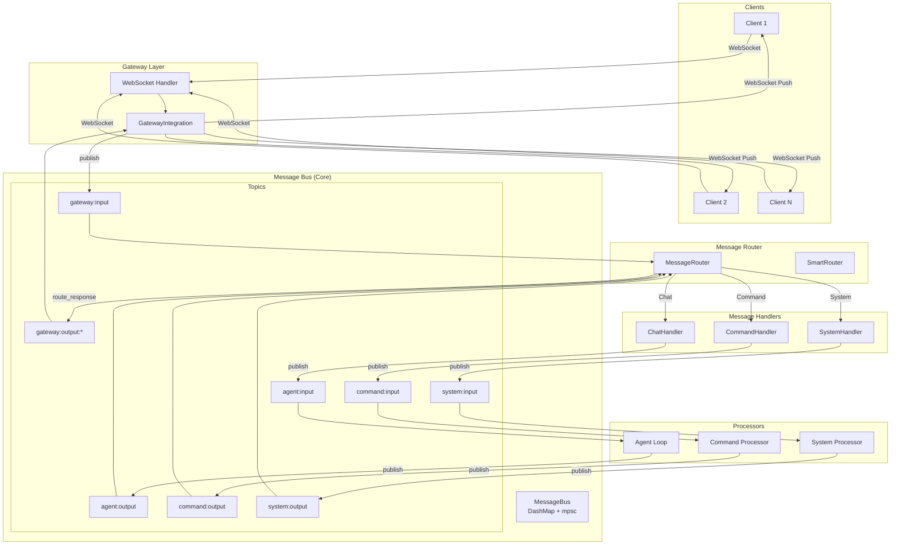

# Bamboo Message Router Architecture



## 消息流详细说明

### 1. 入站消息流 (Client → Agent)

```
┌─────────┐     ┌─────────┐     ┌─────────┐     ┌─────────┐     ┌─────────┐
│ Client  │────►│ Gateway │────►│  Router │────►│ Handler │────►│  Agent  │
└─────────┘     └─────────┘     └─────────┘     └─────────┘     └─────────┘
    │               │               │               │               │
    │  WebSocket    │  publish()    │  route()      │  handle()     │
    │  JSON         │  topic:       │  to:          │  to:          │  process()
    │               │  gateway:input│  agent:input  │  agent:input  │
    │               │               │               │               │
    ▼               ▼               ▼               ▼               ▼
  "Hello!"      Message        Message         Message         "Response"
```

### 2. 出站消息流 (Agent → Client)

```
┌─────────┐     ┌─────────┐     ┌─────────┐     ┌─────────┐     ┌─────────┐
│  Agent  │────►│ Handler │────►│  Router │────►│ Gateway │────►│ Client  │
└─────────┘     └─────────┘     └─────────┘     └─────────┘     └─────────┘
    │               │               │               │               │
    │  publish()    │  publish()    │  route()      │  WebSocket    │
    │  topic:       │  topic:       │  to:          │  Push         │
    │  agent:output │  agent:output │  gateway:     │               │
    │               │               │  output:{id}  │               │
    │               │               │               │               │
    ▼               ▼               ▼               ▼               ▼
  "Response"     Message        Message         Message         "Response"
```

## 核心组件职责

| 组件 | 职责 | 关键实现 |
|------|------|----------|
| **MessageBus** | 消息通道管理 | `DashMap<String, mpsc::Sender>` |
| **MessageRouter** | 消息分发 | 处理器注册 + 路由逻辑 |
| **MessageHandler** | 消息处理 trait | `async fn handle()` |
| **GatewayIntegration** | WebSocket 管理 | 客户端注册/注销 |
| **AgentIntegration** | Agent 调用 | LLM API 集成 |

## 主题命名规范

```
{component}:{direction}[:{identifier}]

Examples:
- gateway:input          # 来自客户端的消息
- gateway:output:abc123  # 发送给特定客户端
- agent:input            # 发送给 Agent
- agent:output           # Agent 输出
- session:xyz789         # 会话特定消息
```